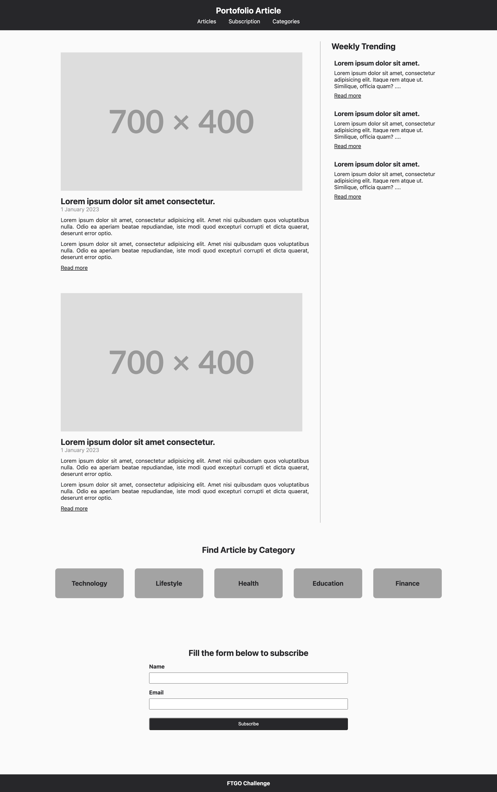

# Graded Challenge 1

Graded Challenge ini dibuat guna mengevaluasi pembelajaran pada Hacktiv8 Program Fulltime Golang khususnya pada pembelajaran HTML dan CSS

## Assignment Objectives
Graded Challenge 1 ini dibuat guna mengevaluasi pemahaman HTML & CSS sebagai berikut:

- Mampu memahami syntax HTML & CSS
- Mampu memahami konsep penerapan tag HTML & CSS
- Mampu melakukan styling sederhana dengan implementasi HTML & CSS

## Assignment Directions

Buatlah website portfolio dengan implementasi HTML Dan CSS dengan ekspektasi tampilan seperti dibawah ini: 

 

NOTE: Silahkan Explore Penggunaan tag dan syntax HTML serta CSS external
RESTRICTION: Tidak boleh menggunakan built-in function apapun.

## Assignment Submission
Push Assigment yang telah Anda buat ke Repository Github Classroom Anda masing-masing.

## Assignment Rubrics
| Criteria    | Expectation                                                                        |
|-------------|------------------------------------------------------------------------------------|
| HTML        | Mampu membuat Tag HTML sesuai ekpektasi                                            |
|             | Mampu menghubungkan file HTML dengan CSS                                           |
| CSS         | Mampu membuat responsive pages pada ukuran 321 x 400 px                            |
|             | Mampu membuat syntax CSS sesuai ekspektasi                                         |
| Readability | Management files dalam folder yang baik                                            |
|             | Semua baris kode terdokumentasi dengan baik, dengan markdown untuk penjelasan kode |

<b>Kriteria readability diantaranya adalah:</b> 
1. Tidak menyalin files html dan css dari tugas lain.
2. Pemakaian tag HTML dan CSS yang optimal (Heading, text formating, dll).
3. Terdapat komentar pada setiap baris kode.
4. Adanya pemisah yang jelas antar section, dll.
5. Tidak adanya typo.

Total Points : 100
Notes Deadline : <b>P0W2D1 pukul 18:00 WIB.</b>

Keterlambatan pengumpulan tugas mengakibatkan skor GC 1 menjadi 0.
